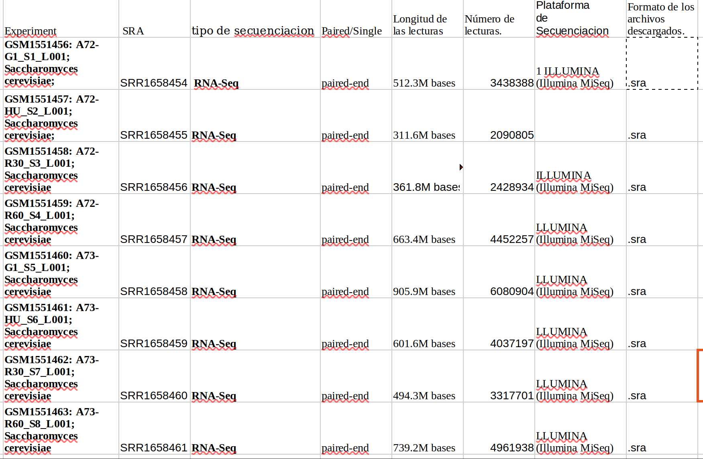

- Introducción: El organismo que se estudio fue "Saccharomuces cerevisiae" (Eukaryota; Fungi; Dikarya) con codigo de identificacion.

- Contexto biológico: PRJNA268110, GEO: GSE63516 (levadura de panadería), un organismo modelo ampliamente utilizado en biología molecular y genética.

- Objetivo del estudio: El objetivo del estudio fue analizar... datos de secuenciación de RNA (RNA-Seq).a traves del estudio a manos de: Wenyi Feng, Bioquímica y Biología Molecular, Universidad Médica del Norte del Suny. Genome Res, 2015 Mar;25(3):402-12.

con el fin de: revelar la fragilidad cromosómica inducida por hidroxiurea como resultado de un conflicto no programado entre la replicación y la transcripción del ADN.

- Datos y metodología

- Fuentes de datos. Los datos estan disponibles en bases de datos pblicas como NCBi en donde podemos encontrarlo buscando:PRJNA268110

  

  - BioProject/BioSample/SRA:

  \### A. BioProject (`PRJNA...`)

  Representa el **proyecto de investigación completo**.

  Por ejemplo, un grupo de investigación quiere estudiar la expresión génica de una bacteria bajo distintas condiciones ambientales. El BioProject reúne la información general de ese estudio y relaciona los registros asociados.

  **Pregunta que responde:** ¿A qué proyecto de investigación pertenecen estos datos?

  \### B. BioSample (`SAMN...`)

  Representa una **muestra biológica específica** utilizada en el estudio.

  Por ejemplo, un investigador obtiene muestras de una bacteria cultivada en dos condiciones diferentes. Cada muestra puede tener su propio registro BioSample.

  **Pregunta que responde:** ¿Qué material biológico se estudió?

  \### C. SRA Experiment (`SRX...`)

  Describe el **experimento de secuenciación asociado a una muestra**.

  Incluye información técnica sobre cómo se preparó y secuenció la muestra, como la estrategia de secuenciación, el diseño de la biblioteca y la plataforma utilizada.

  Una misma muestra biológica puede estar asociada con varios experimentos si se realizan diferentes procedimientos de secuenciación.

  **Pregunta que responde:** ¿Cómo se diseñó y realizó el experimento de secuenciación?

  \### D. SRA Run (`SRR...`)

  Representa una **ejecución de secuenciación que genera datos de lecturas**.

  Es especialmente importante en bioinformática porque los datos de las lecturas crudas se pueden recuperar desde los registros SRA Run.

- Datos descargados: \# modulo: \$module load sra/3.1.1 #Descarga: \$prefetch SRR1658454 SRR1658455 SRR1658456 SRR1658457 SRR1658458 SRR1658459 SRR1658460 SRR1658461

#Conversión a FASTQ: \$fasterq-dump SRR1658454 SRR1658455 SRR1658456 SRR1658457 SRR1658458 SRR1658459 SRR1658460 SRR1658461

#Número de archivos descargados: \$find . -maxdepth 1 -type f -name "*.fastq" \| wc -l #Tamaño de los archivos: \$ du -h SRR*.fastq #Numero de secuencias: awk 'END {print "Numero de lecturas:", NR/4}' SRR1658454_1.fastq awk 'END {print "Numero de lecturas:", NR/4}' SRR1658454_2.fastq awk 'END {print "Numero de lecturas:", NR/4}' SRR1658455_1.fastq awk 'END {print "Numero de lecturas:", NR/4}' SRR1658455_2.fastq awk 'END {print "Numero de lecturas:", NR/4}' SRR1658456_1.fastq awk 'END {print "Numero de lecturas:", NR/4}' SRR1658456_2.fastq awk 'END {print "Numero de lecturas:", NR/4}' SRR1658457_1.fastq awk 'END {print "Numero de lecturas:", NR/4}' SRR1658457_2.fastq awk 'END {print "Numero de lecturas:", NR/4}' SRR1658458_1.fastq awk 'END {print "Numero de lecturas:", NR/4}' SRR1658458_2.fastq awk 'END {print "Numero de lecturas:", NR/4}' SRR1658459_1.fastq awk 'END {print "Numero de lecturas:", NR/4}' SRR1658459_2.fastq awk 'END {print "Numero de lecturas:", NR/4}' SRR1658460_1.fastq awk 'END {print "Numero de lecturas:", NR/4}' SRR1658460_2.fastq awk 'END {print "Numero de lecturas:", NR/4}' SRR1658461_1.fastq awk 'END {print "Numero de lecturas:", NR/4}' SRR1658461_2.fastq

#Longitud promedio de las lecturas: \$ awk 'FNR % 4 == 2 { longitud = length(\$0) total\[FILENAME\]++ bases\[FILENAME\] += longitud } END { for (archivo in total) printf "%s\tLecturas: %d\tLongitud promedio: %.2f nt\n", archivo, total\[archivo\], bases\[archivo\]/total\[archivo\] }' SRR\*.fastq \| sort

#Lecturas son paired-end o single-end: \$ awk 'END {print "R1:", NR/4}' SRR1658454_1.fastq \$ awk 'END {print "R2:", NR/4}' SRR1658454_2.fastq \$ awk 'END {print "R1:", NR/4}' SRR1658455_1.fastq \$ awk 'END {print "R2:", NR/4}' SRR1658455_2.fastq \$ awk 'END {print "R1:", NR/4}' SRR1658456_1.fastq \$ awk 'END {print "R2:", NR/4}' SRR1658456_2.fastq \$ awk 'END {print "R1:", NR/4}' SRR1658457_1.fastq \$ awk 'END {print "R2:", NR/4}' SRR1658457_2.fastq \$ awk 'END {print "R1:", NR/4}' SRR1658458_1.fastq \$ awk 'END {print "R2:", NR/4}' SRR1658458_2.fastq \$ awk 'END {print "R1:", NR/4}' SRR1658459_1.fastq \$ awk 'END {print "R2:", NR/4}' SRR1658459_2.fastq \$ awk 'END {print "R1:", NR/4}' SRR1658460_1.fastq \$ awk 'END {print "R2:", NR/4}' SRR1658460_2.fastq \$ awk 'END {print "R1:", NR/4}' SRR1658461_1.fastq \$ awk 'END {print "R2:", NR/4}' SRR1658461_2.fastq

#Mostrar secuencia cruda: head -n 4 SRR1658454_1.fastq

primera: Identificador de la lectura y, según el formato, información adicional. Segunda: Secuencia de nucleótidos leída por el secuenciador. Tercera: Separador entre la secuencia y las puntuaciones de calidad puede incluir información adicional. Cuarta: Puntuaciones de calidad codificadas como caracteres ASCII, una por cada base de la secuencia. 4. Cuantificación y exploración básica #Cargar el modulo: \$ module load module load fastqc/0.11.3 \$ fastqc \*.fastq

| Métrica \| Resultado \|
| Corridas SRA \| 8 \|
| Archivos FASTQ \| 16 \|
| Reads en R1 \| 30,808,124 \|
| Reads en R2 \| 30,808,124 \|
| **Total de reads individuales** \| **61,616,248** \|
| **Total de pares de lecturas** \| **30,808,124** \|

\$awk 'END {print "Total de lecturas individuales:", NR/4}' SRR\*.fastq

# Obtener la longitud de las lecturas:

\$ awk 'FNR % 4 == 2 {total++; bases += length(\$0)} END {printf "Lecturas: %d\nLongitud promedio: %.2f nt\n", total, bases/total}' SRR1658454_1.fastq

-Resultados: #Descargas: SRR1658454.sra SRR1658455.sra SRR1658456.sra SRR1658457.sra SRR1658458.sra SRR1658459.sra SRR1658460.sra SRR1658461.sra

#Conversión a FASTQ: SRR1658454_1.fastq SRR1658454_2.fastq SRR1658455_1.fastq SRR1658455_2.fastq SRR1658456_1.fastq SRR1658456_2.fastq SRR1658457_1.fastq SRR1658457_2.fastq SRR1658458_1.fastq SRR1658458_2.fastq SRR1658459_1.fastq SRR1658459_2.fastq SRR1658460_1.fastq SRR1658460_2.fastq SRR1658461_1.fastq SRR1658461_2.fastq

#Tamaño de los archivos:

741M SRR1658454_1.fastq 740M SRR1658454_2.fastq 449M SRR1658455_1.fastq 449M SRR1658455_2.fastq 522M SRR1658456_1.fastq 522M SRR1658456_2.fastq 960M SRR1658457_1.fastq 960M SRR1658457_2.fastq 1.3G SRR1658458_1.fastq 1.3G SRR1658458_2.fastq 870M SRR1658459_1.fastq 870M SRR1658459_2.fastq 715M SRR1658460_1.fastq 714M SRR1658460_2.fastq 1.1G SRR1658461_1.fastq 1.1G SRR1658461_2.fastq

#Numero de secuencias: Archivo: SRR1658454_1.fastq Lecturas: 3438388 Archivo: SRR1658454_2.fastq Lecturas: 3438388 Archivo: SRR1658455_1.fastq Lecturas: 2090805 Archivo: SRR1658455_2.fastq Lecturas: 2090805 Archivo: SRR1658456_1.fastq Lecturas: 2428934 Archivo: SRR1658456_2.fastq Lecturas: 2428934 Archivo: SRR1658457_1.fastq Lecturas: 4452257 Archivo: SRR1658457_2.fastq Lecturas: 4452257 Archivo: SRR1658458_1.fastq Lecturas: 6080904 Archivo: SRR1658458_2.fastq Lecturas: 6080904 Archivo: SRR1658459_1.fastq Lecturas: 4037197 Archivo: SRR1658459_2.fastq Lecturas: 4037197 Archivo: SRR1658460_1.fastq Lecturas: 3317701 Archivo: SRR1658460_2.fastq Lecturas: 3317701 Archivo: SRR1658461_1.fastq Lecturas: 4961938 Archivo: SRR1658461_2.fastq Lecturas: 4961938

#Longitud promedio de las lecturas:

SRR1658454_1.fastq Lecturas: 3438388 Longitud promedio: 74.53 nt SRR1658454_2.fastq Lecturas: 3438388 Longitud promedio: 74.46 nt SRR1658455_1.fastq Lecturas: 2090805 Longitud promedio: 74.53 nt SRR1658455_2.fastq Lecturas: 2090805 Longitud promedio: 74.48 nt SRR1658456_1.fastq Lecturas: 2428934 Longitud promedio: 74.51 nt SRR1658456_2.fastq Lecturas: 2428934 Longitud promedio: 74.45 nt SRR1658457_1.fastq Lecturas: 4452257 Longitud promedio: 74.53 nt SRR1658457_2.fastq Lecturas: 4452257 Longitud promedio: 74.47 nt SRR1658458_1.fastq Lecturas: 6080904 Longitud promedio: 74.52 nt SRR1658458_2.fastq Lecturas: 6080904 Longitud promedio: 74.45 nt SRR1658459_1.fastq Lecturas: 4037197 Longitud promedio: 74.53 nt SRR1658459_2.fastq Lecturas: 4037197 Longitud promedio: 74.48 nt SRR1658460_1.fastq Lecturas: 3317701 Longitud promedio: 74.53 nt SRR1658460_2.fastq Lecturas: 3317701 Longitud promedio: 74.47 nt SRR1658461_1.fastq Lecturas: 4961938 Longitud promedio: 74.52 nt SRR1658461_2.fastq Lecturas: 4961938 Longitud promedio: 74.46 nt

#Lecturas son paired-end o single-end: R1: 3438388 R2: 3438388 R1: 2090805 R2: 2090805 R1: 2428934 R2: 2428934 R1: 4452257 R2: 4452257 R1: 6080904 R2: 6080904 R1: 4037197 R2: 4037197 R1: 3317701 R2: 3317701 R1: 4961938 R2: 4961938

#Mostrar secuencia cruda:

@SRR1658454.1 1 length=75 CGGGAATTCATCATCAGTCCTTCCCACTAAGTAAACAAGGTGTCTTCATCTCTCAAATACTCACCAATATCTGCT +SRR1658454.1 1 length=75 668--+CFF9FGGGGGGGGGGGGGGGGGGGGGFFDFFGFFG8CFFFF9FFFGFGFAAFFFDF,CFC8F,CCC,\<C \[agarcia\@ken agarcia\]\$

# Obtener la longitud de las lecturas:
